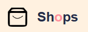
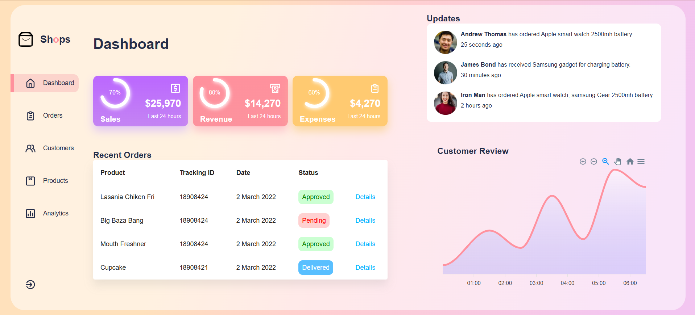
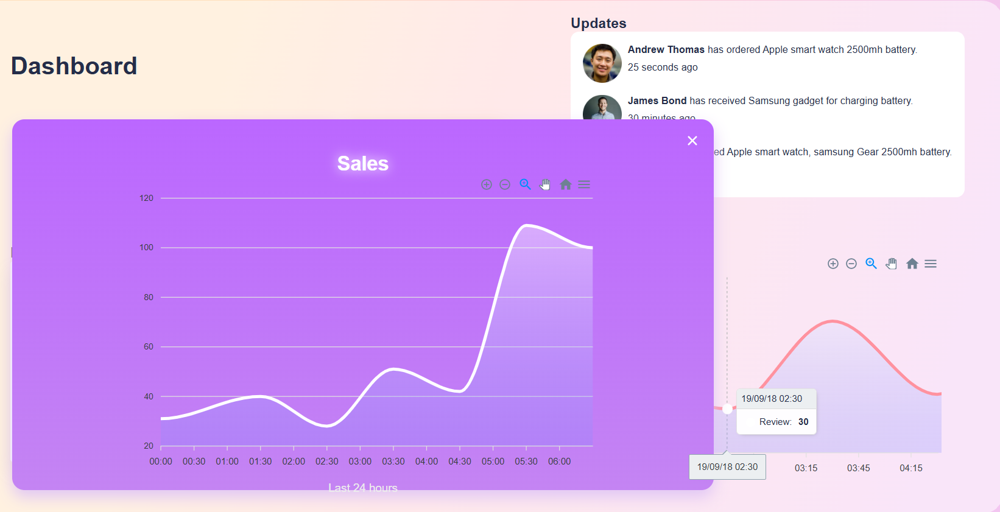
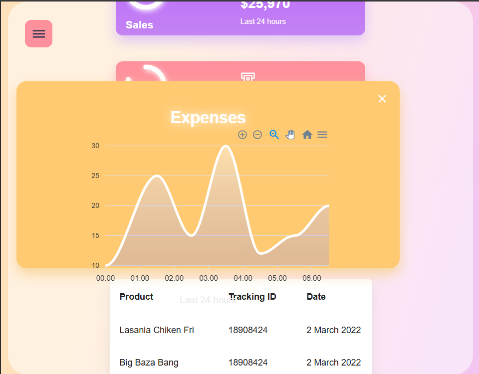
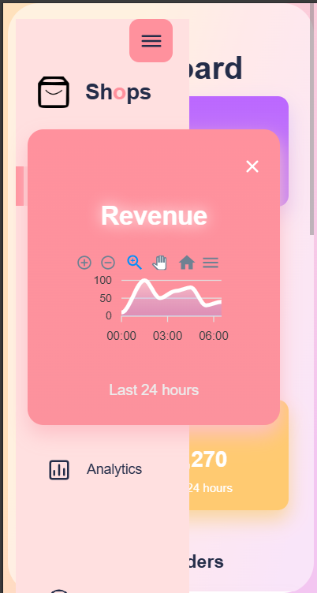

# 🛍️ Shops Dashboard — Admin Panel



**A modern, clean, and fully responsive admin dashboard built with React**

[](https://react.dev/)
[](https://vitejs.dev/)
[](https://eslint.org/)

---

## 📌 Table of Contents

- [About the Project](#-about-the-project)
- [Features](#-features)
- [Screenshots](#-screenshots)
- [Tech Stack](#️-tech-stack)
- [Project Structure](#-project-structure)
- [Pages & Components](#-pages--components)
- [Data Flow](#-data-flow)
- [Responsive Design](#-responsive-design)
- [Getting Started](#-getting-started)
- [Available Scripts](#-available-scripts)
- [Dependencies](#-dependencies)
- [Development Journey](#️-development-journey)
- [Future Enhancements](#-future-enhancements)
- [Acknowledgements](#-acknowledgements)
- [License](#-license)

---

## 📖 About the Project

**Shops Dashboard** is a clean, card-based admin panel built with **React**, developed as a practice project to explore dashboard UI patterns — analytics summary cards, data tables, activity feeds, and trend charts — inside a single cohesive layout.

The current build focuses on the **Dashboard** view: styled sales/revenue/expense summary cards, a recent orders table, a customer activity feed, and a customer review trend chart. The remaining sidebar destinations (**Orders, Customers, Products, Analytics**) are scaffolded in the navigation and reserved for future development.

---

## ✨ Features

### 🏠 Dashboard (Built)

- **Summary Cards** — Sales, Revenue, and Expenses cards, each with a circular progress indicator and a "last 24 hours" figure
- **Recent Orders Table** — product name, tracking ID, order date, and a color-coded status badge (Approved / Pending / Delivered), with a "Details" link per row
- **Updates / Activity Feed** — a running list of recent customer activity, each entry showing an avatar, name, action, and relative timestamp
- **Customer Review Chart** — a trend chart plotting customer review activity over time, with zoom, pan, and reset controls
- **Sidebar Navigation** — branded "Shops" logo, icon-led nav items, and a logout action pinned to the bottom

### 🧭 Scaffolded for Future Development

- **Orders** — dedicated order management page
- **Customers** — customer records page
- **Products** — product catalog/management page
- **Analytics** — deeper analytics/reporting page

> These currently exist as sidebar entries only; their pages/routes are not yet built out.

---

## 📸 Screenshots

### 🏠 Dashboard






_(Dashboard screenshot — summary cards, recent orders, updates feed, and customer review chart)_

---

## 🛠️ Tech Stack

| Technology                     | Version | Purpose                                       |
| ------------------------------ | ------- | --------------------------------------------- |
| **React**                      | 19.2.6  | Core frontend framework                       |
| **react-circular-progressbar** | 2.2.0   | Circular progress indicators on summary cards |
| **@iconscout/react-unicons**   | 2.2.5   | Icon set used across the sidebar and cards    |
| **Vite**                       | —       | Build tool & dev server                       |
| **ESLint**                     | —       | Code quality checks                           |
| **Charting library**           | —       | Powers the Customer Review trend chart        |

---

## 📁 Project Structure

```
shops-dashboard/
│
├── public/
│
├── src/
│   ├── components/
│   │   ├── Card/
│   │   │   ├── Card.jsx              → Single summary card (Sales / Revenue / Expenses)
│   │   │   └── Card.css
│   │   ├── Cards/
│   │   │   ├── Cards.jsx             → Renders the row of summary Card components
│   │   │   └── Cards.css
│   │   ├── CustomerReview/
│   │   │   ├── CustomerReview.jsx    → Customer review trend chart
│   │   │   └── CustomerReview.css
│   │   ├── MainDash/
│   │   │   ├── MainDash.jsx          → Main dashboard layout combining Cards, Table, RightSide
│   │   │   └── MainDash.css
│   │   ├── RightSide/
│   │   │   ├── RightSide.jsx         → Right-hand column wrapper (Updates + CustomerReview)
│   │   │   └── RightSide.css
│   │   ├── Table/
│   │   │   ├── Table.jsx             → Recent Orders table with status badges
│   │   │   └── Table.css
│   │   ├── Updates/
│   │   │   ├── Updates.jsx           → Customer activity / updates feed
│   │   │   └── Updates.css
│   │   ├── Sidebar.jsx               → Branded sidebar navigation + logout
│   │   └── Sidebar.css
│   │
│   ├── Data/
│   │   └── Data.js                   → Static demo data (cards, orders, updates)
│   │
│   ├── imgs/
│   │   ├── img1.png / img2.png / img3.png
│   │   ├── logo.png
│   │   └── profile.png
│   │
│   ├── App.jsx                       → Root component, renders Sidebar + MainDash
│   ├── App.css
│   ├── index.css
│   └── main.jsx                      → React DOM entry point
│
├── .gitignore
├── eslint.config.js
├── index.html
├── package.json
├── package-lock.json
├── vite.config.js
└── README.md
```

---

## 📄 Pages & Components

### `App.jsx`

The root component. Renders the persistent `Sidebar` alongside `MainDash`, which currently is the only routed/visible dashboard view.

### `Sidebar.jsx`

- Displays the "Shops" logo and brand name
- Icon-led navigation list (Dashboard, Orders, Customers, Products, Analytics) using `@iconscout/react-unicons`
- Logout action pinned to the bottom of the sidebar

### `MainDash.jsx`

- Composes the dashboard page: renders `Cards` at the top, `Table` (Recent Orders) below it, and `RightSide` (Updates + CustomerReview) alongside

### `Cards.jsx` / `Card.jsx`

- `Cards` maps over summary data (Sales, Revenue, Expenses) from `Data.js` and renders a `Card` for each
- `Card` displays the label, dollar amount, "last 24 hours" caption, and a `react-circular-progressbar` indicator reflecting the percentage value

### `Table.jsx`

- Renders the Recent Orders table from `Data.js`
- Status column renders a colored badge per row (green = Approved, red = Pending, blue = Delivered)
- Each row includes a "Details" link

### `Updates.jsx`

- Maps over an activity list from `Data.js`, rendering an avatar, name, action text, and relative timestamp per entry

### `CustomerReview.jsx`

- Renders the customer review trend chart with time-axis labels and interactive zoom/pan/reset controls

---

## 🔄 Data Flow

The dashboard is currently **static and presentational** — there's no backend, global state library, or Context API in use.

```
Data.js  (static demo data)
   │
   ▼
MainDash.jsx
   ├── Cards.jsx     → Card.jsx × 3      (Sales / Revenue / Expenses)
   ├── Table.jsx                          (Recent Orders)
   └── RightSide.jsx
         ├── Updates.jsx                  (Activity feed)
         └── CustomerReview.jsx           (Trend chart)
```

All values shown (order statuses, card percentages, review trend, activity feed) come directly from `Data/Data.js` — swapping in a real API would mean replacing that import with a fetch/query in `MainDash.jsx` and passing the results down the same way.

---

## 📱 Responsive Design

The layout is built to adapt across common breakpoints:

| Breakpoint        | Target                 |
| ----------------- | ---------------------- |
| `1280px+`         | Desktop                |
| `1024px – 1279px` | Small desktop / laptop |
| `768px – 1023px`  | Tablet                 |
| `< 768px`         | Mobile                 |

> Note: confirm the exact breakpoints/media queries used in your CSS files if you'd like this table to be precise rather than indicative.

---

## 🚀 Getting Started

### Prerequisites

- **Node.js** (v18 or higher recommended)
- **npm** or **yarn**

### Installation

```bash
# 1. Clone the repository
git clone https://github.com/yourusername/shops-dashboard.git

# 2. Navigate into the project directory
cd shops-dashboard

# 3. Install dependencies
npm install

# 4. Start the development server
npm run dev
```

Open `http://localhost:5173` to view it in the browser.

---

## 📜 Available Scripts

| Script            | Description                           |
| ----------------- | ------------------------------------- |
| `npm run dev`     | Starts the development server         |
| `npm run build`   | Builds the app for production         |
| `npm run preview` | Previews the production build locally |
| `npm run lint`    | Runs ESLint for code quality checks   |

> Confirm these against your actual `package.json` `scripts` block — they're assumed based on the Vite/ESLint config files present in your folder structure.

---

## 📦 Dependencies

```json
{
  "dependencies": {
    "@iconscout/react-unicons": "^2.2.5",
    "react-circular-progressbar": "^2.2.0"
  }
}
```

---

## 🛤️ Development Journey

1. **Project Setup** — Initialized the React project with Vite and ESLint
2. **Sidebar** — Built the branded sidebar with icon navigation and logout action
3. **Summary Cards** — Built `Card`/`Cards` with circular progress indicators for Sales, Revenue, and Expenses
4. **Recent Orders Table** — Built the `Table` component with status badges and per-row details links
5. **Updates Feed** — Built the `Updates` activity feed with avatars and relative timestamps
6. **Customer Review Chart** — Built the `CustomerReview` trend chart with interactive controls
7. **Dashboard Assembly** — Composed all pieces together in `MainDash`
8. **Remaining Nav Items** — Orders, Customers, Products, and Analytics scaffolded in the sidebar for future build-out

---

## 🔮 Future Enhancements

- [ ] Build out the **Orders** page
- [ ] Build out the **Customers** page
- [ ] Build out the **Products** page
- [ ] Build out the **Analytics** page
- [ ] Replace static `Data.js` with a real API/backend
- [ ] Dark / light mode toggle
- [ ] User authentication
- [ ] Export functionality (CSV / PDF)

---

## 🙌 Acknowledgements

- Icons provided by [Unicons via @iconscout/react-unicons](https://www.npmjs.com/package/@iconscout/react-unicons)
- Circular progress indicators via [react-circular-progressbar](https://www.npmjs.com/package/react-circular-progressbar)
- Built and developed as a practice project exploring admin dashboard UI patterns

---

## 📃 License

This project is open source and available under the MIT License.

---

**Built with creativity using React**

_🛍️ Shops Dashboard — Practice project for admin panel UI/UX_
